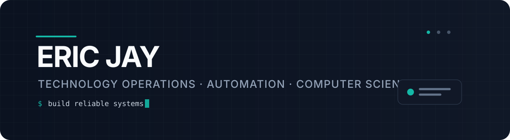

<p align="center">
  
</p>

<p align="center">
  <a href="mailto:ericnjay1996@gmail.com">
    
  </a>
  <a href="https://github.com/ericjaytech">
    
  </a>
  
</p>

## Hello — I'm Eric

I build and improve the operational systems behind technology teams: **asset lifecycle, infrastructure support, service processes, vendor coordination, documentation and practical automation**.

My background spans enterprise environments at **Microsoft** and **Google (via Astreya)**. I am now building **Eric Jay Technology Consulting** while completing a part-time **MS in Computer Science & Artificial Intelligence at Boston University**.

```text
OPERATIONS  →  AUTOMATION  →  SOFTWARE  →  AI
   │               │             │          │
   └──── make systems clearer, faster, more reliable ────┘
```

### What I bring

<table>
<tr>
<td width="50%" valign="top">

#### 🧰 Technology operations
- IT asset lifecycle & inventory
- Data-centre operations
- Hardware diagnostics & RMA
- Procurement & vendor coordination
- Ticket / SLA management
- Workplace technology support

</td>
<td width="50%" valign="top">

#### ⚙️ Systems improvement
- Process design & standardisation
- Operational documentation
- Team training & knowledge transfer
- Data-informed workflow improvement
- Practical automation
- Building towards software & AI engineering

</td>
</tr>
</table>

### Selected impact

| | Outcome |
|---|---|
| **Microsoft** | Contributed to a reported **15% month-on-month reduction in stock discrepancies** through cycle-count audits and stronger inventory controls |
| **Microsoft** | Cross-functional coordination contributed to **~$20k average quarterly savings** against pre-2024 costs |
| **Google / Astreya** | Ranked among the **top three resolvers** for tickets and hardware orders in a 30+ person EMEA team |
| **Google / Astreya** | Reduced high-severity SLA resolution time by **6 hours** against a 24-hour baseline |

### Now building

```yaml
consultancy:
  name: Eric Jay Technology Consulting
  focus:
    - IT asset lifecycle
    - workplace technology operations
    - service-process design
    - practical automation
  availability: September 2026

learning:
  degree: MS Computer Science & Artificial Intelligence
  university: Boston University
  mode: part-time
```

### Toolbox

<p>
  
  
  
  
  
  
  
</p>

### Credentials

- 🎓 **MS, Computer Science & Artificial Intelligence** — Boston University *(in progress)*
- 🎓 **BA (Hons), English Literature** — Birkbeck, University of London
- 🛠️ **CompTIA A+**
- 📊 **Google Data Analytics Certificate**
- 🏉 Former university rugby **President, 1st XV Captain, Captain & Coach**

---

### Contribution activity

<picture>
  <source media="(prefers-color-scheme: dark)" srcset="https://raw.githubusercontent.com/ericjaytech/ericjaytech/output/github-contribution-grid-snake-dark.svg">
  <source media="(prefers-color-scheme: light)" srcset="https://raw.githubusercontent.com/ericjaytech/ericjaytech/output/github-contribution-grid-snake.svg">
  
</picture>

<sub>
This profile is intentionally a work in progress. Public projects, automation experiments and coursework will appear here as they ship.
</sub>

<p align="center">
  <b>Interested in technology operations, automation or consulting?</b><br/>
  <a href="mailto:ericnjay1996@gmail.com">Get in touch →</a>
</p>
